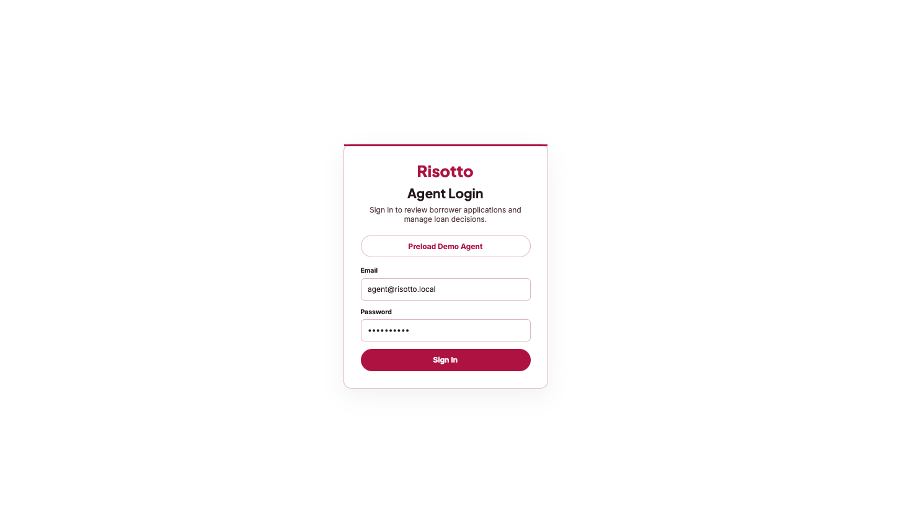
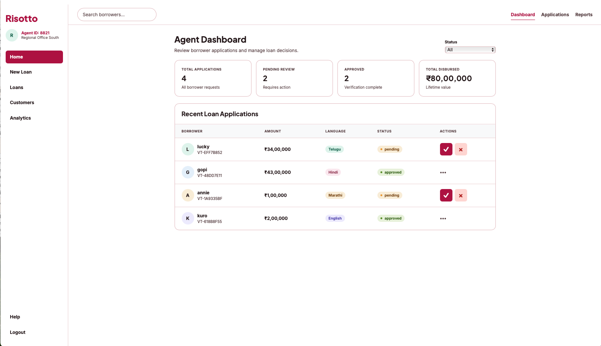
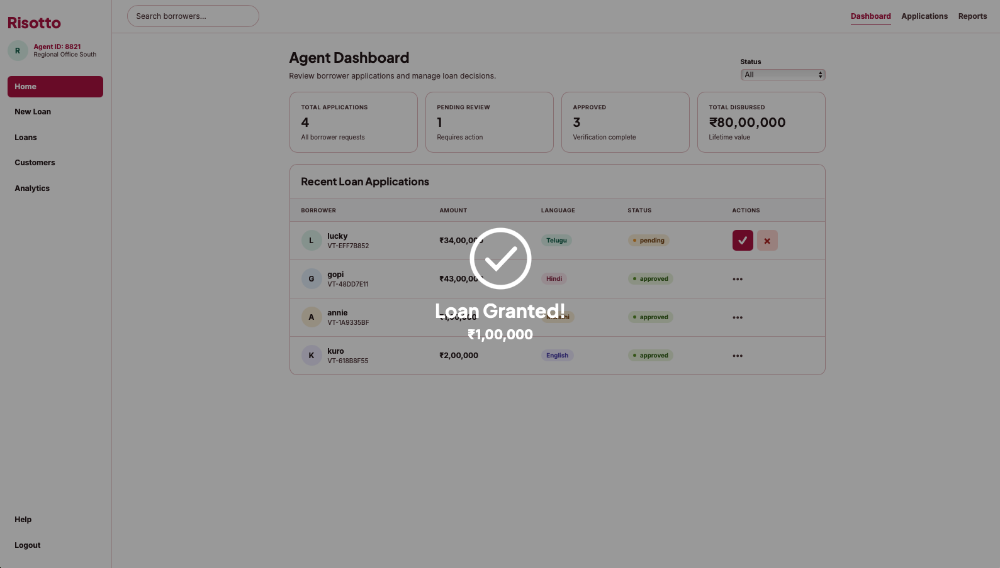
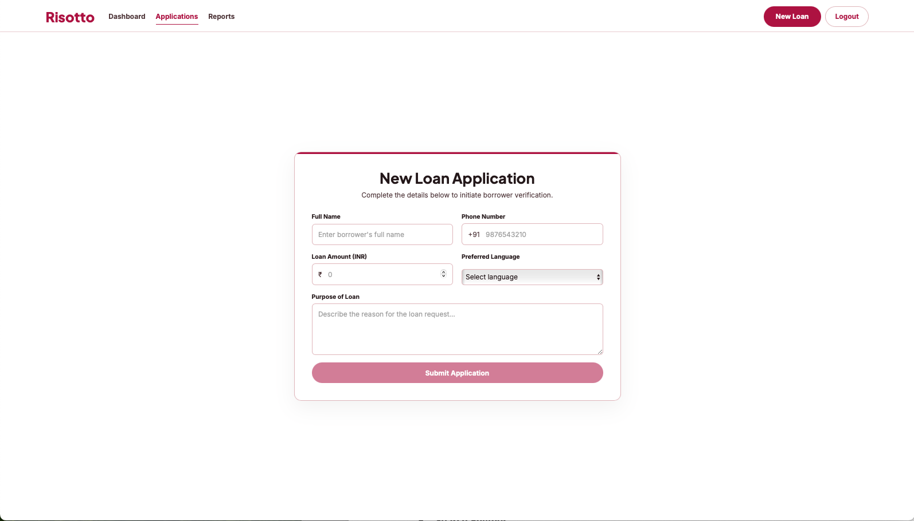

# Risotto Loan Application Portal

Risotto is a mini full-stack loan application portal built as an internship assignment. The project follows the requirement of having a borrower-facing application flow and an agent-facing dashboard for reviewing and managing loan requests.

**Live App:** https://risotto-loan-application-portal.vercel.app

## Demo Login

```text
Email: agent@risotto.local
Password: risotto123
```

## Screenshots

<table>
  <tr>
    <td width="50%">
      <strong>Agent Login</strong><br />
      
    </td>
    <td width="50%">
      <strong>Dashboard</strong><br />
      
    </td>
  </tr>
  <tr>
    <td width="50%">
      <strong>Loan Granted</strong><br />
      
    </td>
    <td width="50%">
      <strong>New Loan Application</strong><br />
      
    </td>
  </tr>
</table>

## Features

- Demo agent login with a preloaded user button
- Borrower loan application form with client-side validation
- Dashboard with summary stats and application table
- Status filter for pending, approved, and rejected applications
- In-place approve/reject actions
- Loan granted overlay animation
- Customers view with borrower details
- Analytics view with approval and language breakdowns
- Responsive frontend built for desktop and smaller screens

## Tech Stack

React + Vite frontend, Node.js + Express backend, PostgreSQL database, deployed with Vercel and Render.

## Local Frontend Setup

```bash
cd frontend
npm install
npm run dev
```

The frontend runs at:

```text
http://localhost:5173
```

## API Overview

| Method | Endpoint | Purpose |
| --- | --- | --- |
| `POST` | `/api/login` | Demo agent login |
| `POST` | `/api/applications` | Submit a loan application |
| `GET` | `/api/applications` | List loan applications |
| `PATCH` | `/api/applications/:id/status` | Approve or reject an application |
| `GET` | `/api/summary` | Dashboard summary stats |

## Notes

- This was built as a mini assignment for an internship application, based on the provided project requirements.
- Render free instances may take a short moment to wake up after inactivity.
